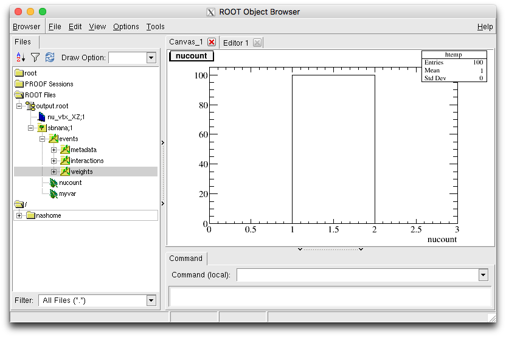

SBN Analysis
============
This package provides a lightweight event analysis and fitting framework for
measurements within the the Short-Baseline Neutrino program at Fermilab.

It is a framework-within-a-framework, built on LArSoft and
[art](http://art.fnal.gov).

Analysis code is stored in subdirectories of `ana`, with one directory per
analysis. Common core code for event I/O is in `core`, and shared utilities
in `util`.

### Processors

The fundamental piece of analysis code is a `Processor`, which operates on
art events and writes an output tree. A processor can add additional
branches to the tree, or save any other desired objects to the output
file. Configuration parameters may be passed to a processor using a
JSON file.

One runs a processor by configuring it a FHiCL file passed to `lar`.

Documentation
-------------
The code is fully documented with Doxygen. To build it, run

    doxygen doc/Doxyfile

The output HTML documentation is placed in `doc/html/index.html`.

*Note to developers:* All code in `sbnanalysis` should be completely
documented with Doxygen-compatible comments. Please build the
documentation before committing to check for anything missing.

Building
--------
`sbnanalysis` is built along with `sbncode` using the standard `mrb` tools.

Tutorial
--------
A primary goal of this package is to centralize development of event selection
code and fitting frameworks, and establish a standard analysis tree format
that is compatible with all fitters. As such, the fundamental object in
`sbnanalysis` is an event processor class which writes a standard ROOT tree,
plus additional user-specified data.

### A Selection Analysis ###
Analysis code is stored in subdirectories of `ana`, one per analysis. These
directories contain any utility code and algorithms, and a selection class
which is a subclass of `core::SelectionBase`. Note that all code should
should be defined inside a namespace `ana::NameOfAnalysis`.

The selection code must define the following methods:

* `void Initialize(Json::Value* config)`: Load configuration parameters and
  perform analysis-specific setup, such as defining histograms, and adding
  custom branches to the output tree.

* `void Finalize()`: Perform analysis-specific tear-down, such as computing
  statistics and writing histograms to the output file.

* `bool ProcessEvent(gallery::Event& ev)`: Perform the event-level analysis,
  such as filling histograms and setting the variables corresponding to the
  custom branches (they will filled -- written to the tree --  automatically).
  The return value is used for event filtering: if `ProcessEvent` returns
  false, the event is not written to the output tree.

The user is free to add arbitrary branches to the default output ROOT tree,
using the method `void AddBranch(std::string name, T* object)` where the first
argument is the branch name and the second is a refernce to the object, which
shold be a member variable of the user's selection class.

Note that `Initialize` (`Finalize`) is called after the after (before) the base
selection class setup and teardown, so you have access to the ROOT output file
and the output tree in these methods.

As an example, a selection subclass might look like this:

```c++
namespace sbnanalysis {
  namespace ana {
    namespace ExampleAnalysis {

class ExampleSelection : public sbnanalysis::ProcessorBase {
public:
  ExampleSelection();
  void Initialize();
  void Finalize();
  bool ProcessEvent(const art::Event& ev,
                    const std::vector<Event::Interaction> &truth,
                    std::vector<Event::RecoInteraction>& reco);

protected:
  int fMyVar;  // For a custom branch

  DECLARE_PROCESSOR(ExampleSelection)
};

    }
  }
}
```

with an implementation like:

```c++
#include <iostream>
#include "art/Framework/Principal/Handle.h"
#include "ExampleSelection.h"

namespace sbnanalysis {
  namespace ana {
    namespace ExampleAnalysis {

// Constructor
ExampleSelection::ExampleSelection() : ProcessorBase() {}

// Setup
void ExampleSelection::Initialize() {
  AddBranch("myvar", &fMyVar);  // Define a custom branch
}

// Teardown
void ExampleSelection::Finalize() {}

// Event processing
bool ExampleSelection::ProcessEvent(
    const gallery::Event& ev,
    const std::vector<Event::Interaction>& truth,
    std::vector<Event::RecoInteraction>& reco) {
  // ... Process the gallery::Event ...
  fMyVar = 42;  // Fill in the custom branch
  return true;
}

// Important!: Declare the selection to sbnanalysis.
REGISTER_PROCESSOR(ExampleSelection)

    }  // namespace ExampleAnalysis
  }  // namespace ana
}  // namespace sbnanalysis
```

Note that the final `REGISTER_PROCESSOR` line is required to run the code
within the sbnanalysis framework.

Finally, new source code must be added to the library definitions in the
`CMakeLists.txt` file within the analysis subdirectory. See the provided
`ExampleAnalysis` for an example.

### Analyzing the Output

The output file is a ROOT file with a tree named `sbnana` plus any additional
objects written by the selection code. The `sbnana` tree contains a branch
called `events`; this is the standard event-level information written out
by all processors, stored in an `Event` object. See `core/Event.hh` for the
complete definition.

To read the output files in ROOT, one must load the event dictionary, which
is stored in `libsbnanalysis_Processor.so`. Compiled code should link to this
library, and on the ROOT command line one can run:

    .L lib/libsbnanalysis_Event.so

Now, we can open the file in a `TBrowser`:



One can make plots interactively, or analyze this tree with a ROOT macro or
script. For example, in the ROOT console:

    root [0] .L lib/libsbnanalysis_Event.so
    root [1] TFile f("output.root")
    root [2] sbnana->Draw("interactions.lepton.energy")

This will produce a plot of the primary lepton energies for all neutrino
interactions:


Examples
--------
A complete example analysis package is provided in `ana/ExampleAnalysis`.

Authors
-------
* A. Mastbaum, UChicago
* G. Putnam, UChicago
* J. Zennamo, UChicago
* D. Schmitz, UChicago
* *Your name here!*

License
-------
This package is licensed under an MIT license. See `LICENSE.txt` for details.

